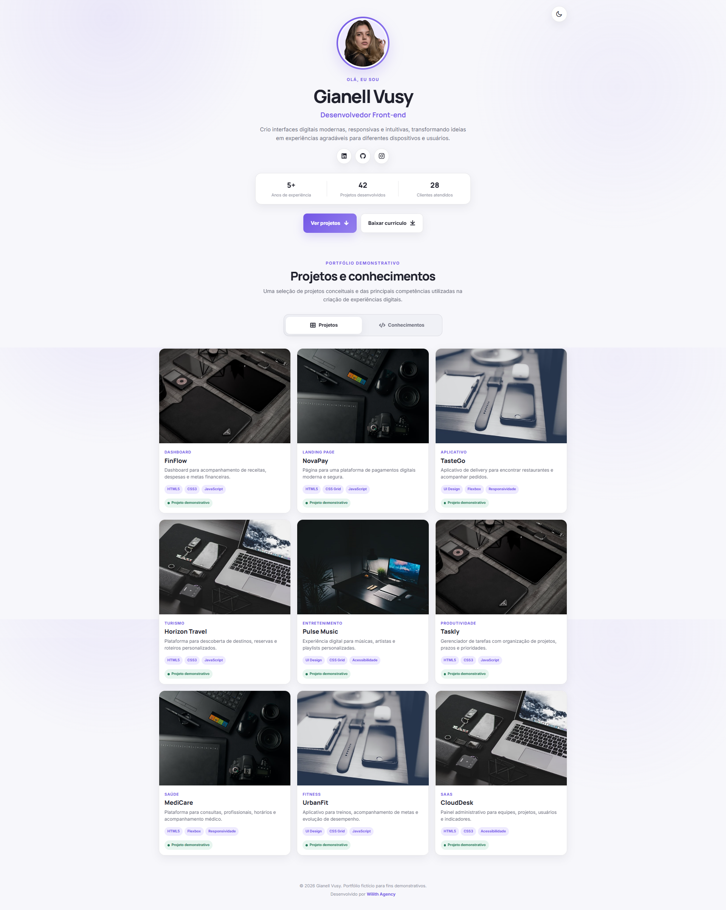

# 💼 Simple Portfolio

Portfólio fictício desenvolvido para apresentar um profissional de desenvolvimento front-end, seus projetos conceituais e conhecimentos técnicos, com foco em design moderno, responsividade, acessibilidade e boas práticas de desenvolvimento.



O projeto foi criado inicialmente durante meus estudos de HTML, CSS e JavaScript e posteriormente refatorado, recebendo melhorias de estrutura, conteúdo, semântica, acessibilidade, responsividade, identidade visual, interatividade e organização do código.

---

## 🌐 Demonstração

🔗 **Acesse o projeto:**

https://simpleportfolio-shippc.netlify.app/

---

## 🚀 Gostou deste projeto?

Este website foi desenvolvido por mim como parte do meu portfólio de desenvolvimento front-end.

Se você procura um site profissional, landing page, portfólio, website institucional ou uma solução personalizada para o seu negócio, conheça meu trabalho na **Wilith Agency**.

🌐 **Portfólio Profissional**

https://wilithagency.netlify.app/

---

## ✨ Funcionalidades

- 👤 Apresentação profissional com foto, nome e área de atuação
- 📊 Indicadores de experiência, projetos desenvolvidos e clientes atendidos
- 🌐 Links para redes sociais
- 📄 Botão para download de currículo
- 🎯 Botão para acesso direto à galeria de projetos
- 🌙 Alternância entre tema claro e escuro
- 🗂️ Abas para alternar entre projetos e conhecimentos
- 🖼️ Galeria com nove projetos demonstrativos
- 🧩 Cards com categorias, descrições e tecnologias
- 💻 Grade com três projetos por linha em telas maiores
- 📱 Adaptação da galeria para tablets e smartphones
- 🛠️ Seção de conhecimentos e ferramentas
- ✨ Animações de entrada com ScrollReveal
- 🎯 Navegação suave entre as seções
- ⌨️ Estados de foco para navegação por teclado
- ♿ Estrutura HTML semântica
- 🏷️ Textos alternativos nas imagens
- 🔍 SEO básico
- 🎨 Efeitos de hover e transições
- 🧩 Componentes reutilizáveis
- 🎞️ Suporte à redução de movimento
- 🔒 Abertura segura de links externos
- 📱 Layout totalmente responsivo

Os nomes, projetos, experiências, estatísticas e demais informações profissionais apresentados na interface são fictícios e possuem finalidade exclusivamente demonstrativa.

---

## 🚀 Tecnologias

- HTML5
- CSS3
- JavaScript
- Google Fonts
- Remix Icon
- ScrollReveal

---

## 📱 Responsividade

O projeto foi desenvolvido para oferecer uma excelente experiência em diferentes dispositivos.

- 💻 Desktop
- 💼 Notebook
- 📱 Tablet
- 📲 Smartphone

---

## 📂 Estrutura

```text
SimplePortfolio/
│
├── css/
│   └── style.css
│
├── img/
│   ├── favicon.png
│   ├── perfil.png
│   ├── preview.png
│   ├── project1.jpg
│   ├── project2.jpg
│   ├── project3.jpg
│   ├── project4.jpg
│   └── project5.jpg
│
├── js/
│   ├── main.js
│   └── scrollreveal.min.js
│
├── pdf/
│   └── Gianell-Cv.pdf
│
├── index.html
└── README.md
```

---

## 🎯 Objetivos do Projeto

Este projeto teve como objetivo praticar e aprimorar conhecimentos em desenvolvimento front-end, incluindo:

- HTML semântico
- CSS moderno
- JavaScript
- Flexbox
- CSS Grid
- Responsividade
- Organização de código
- Variáveis CSS
- Componentes reutilizáveis
- Hierarquia visual
- Tipografia responsiva
- Manipulação do DOM
- Eventos do JavaScript
- Tema claro e escuro
- Uso de `localStorage`
- Abas interativas
- Cards de projetos
- Navegação por teclado
- Atributos ARIA
- Estados de interação
- Acessibilidade
- SEO
- Animações com ScrollReveal
- Suporte a `prefers-reduced-motion`
- Estruturação de portfólios
- Refatoração de projetos antigos

---

## 👨‍💻 Autor

### Wilhan Mac'Arthur

Desenvolvedor Front-end e fundador da **Wilith Agency**, especializado na criação de websites modernos, landing pages, portfólios profissionais e soluções para empresas.

### 🌐 Links

- **Portfólio:** https://wilithagency.netlify.app/
- **GitHub:** https://github.com/shippc
- **LinkedIn:** https://www.linkedin.com/in/wilhanmacarthur/

---

⭐ Se este projeto foi útil ou serviu de inspiração, considere deixar uma estrela no repositório.